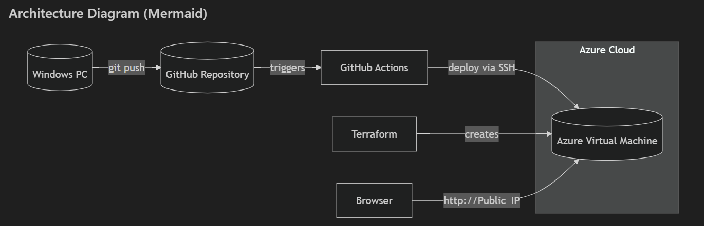

# System Architecture

The system architecture demonstrates a fully automated cloud deployment pipeline on Azure.

## Architecture Workflow

The workflow operates through these stages:

1. **Infrastructure Provisioning**  
   Terraform provisions an Azure Virtual Machine and networking resources.

2. **Server Configuration**  
   Ansible installs Docker and configures the VM to run containers.

3. **Application Containerisation**  
   The Node.js web application is packaged into a Docker container and run on the VM.

4. **Continuous Integration & Deployment**  
   GitHub Actions rebuilds and redeploys the container whenever code is pushed.

5. **User Access**  
   Users access the application via browser using the VM public IP.

---

## Architecture Diagram



<!--
Mermaid code reference (for editing / VS Code Preview)

```mermaid
flowchart LR
  Dev[(Windows PC)]
  Repo[(GitHub Repository)]
  GH[GitHub Actions]
  TF[Terraform]
  VM[(Azure Virtual Machine)]
  User[Browser]

  Dev -- "git push" --> 